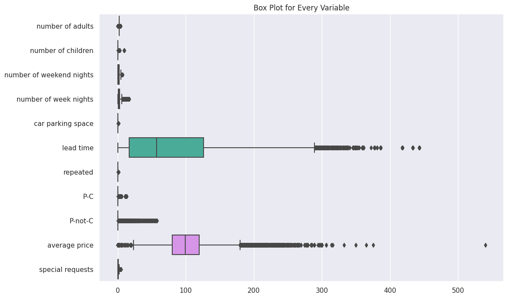
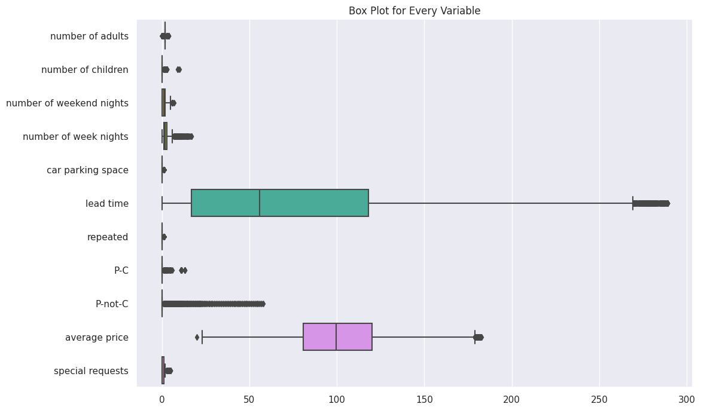
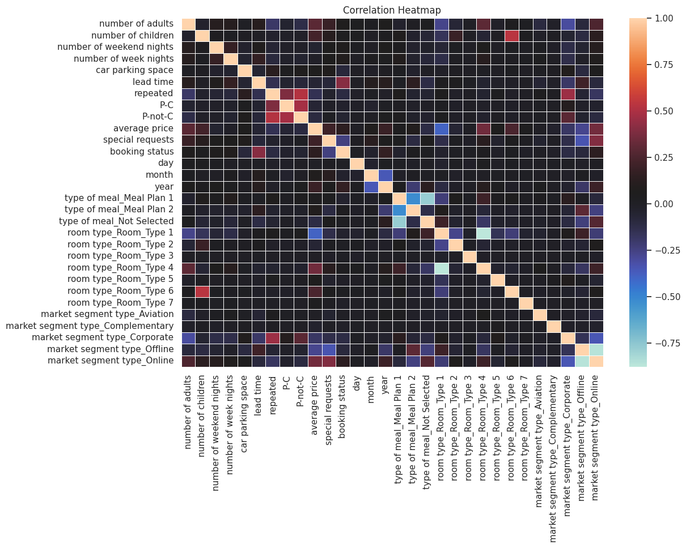
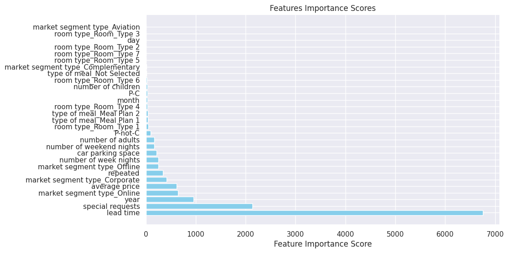
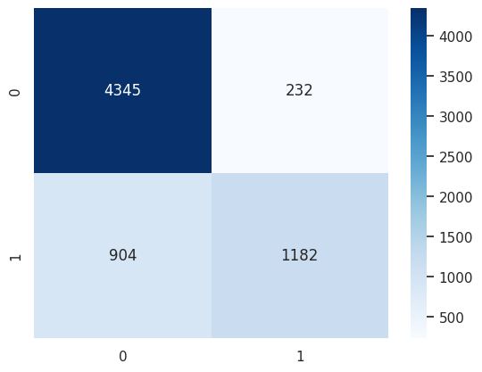
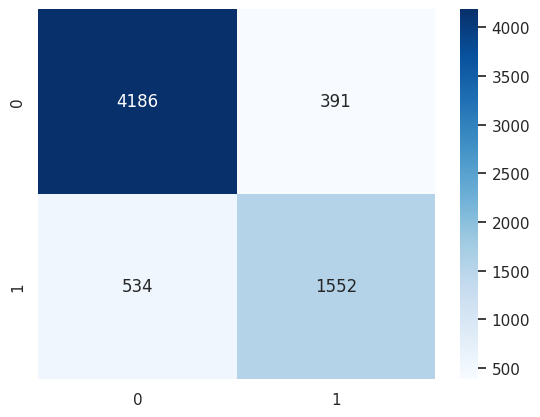
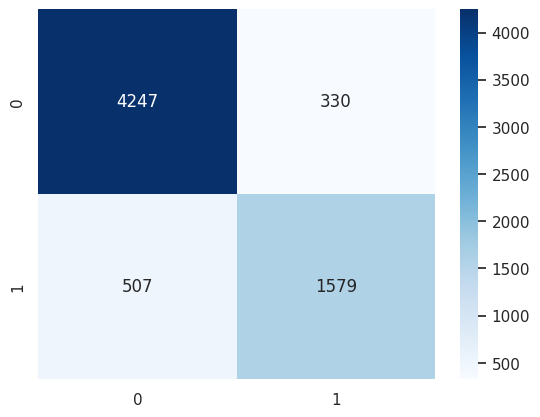
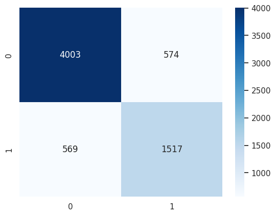

# Hotel Booking Cancellation Prediction Using Multiple Models & Deployed Using Flask

**Preprocessing:**

* [Load Dataset](#load-dataset)
* [Exploratory Data Analysis](#understanding-the-dataset)
* [Cleaning Data](#data-cleansing--preprocessing)
* [Remove Outliers](#droping-outliers)
* [Encoding Categorical Variables](#apply-one-hot-encoding-on-variables-of-datatype--object)
* [Visualize Correlation Between Variables](#visualize-the-correlation-between-variables)
* [Feature Selection](#feature-selection)
* [Split Data into Train & Test Data](#split-data-into-train--test)

**Models Used:**

* [Logistic Regression](#logistic-regression)
* [KNN](#knn)
* [SVC](#svc)
* [Decision Tree](#decision-tree-classifier)
* [Random Forest](#random-forest)

**Deployment:**
* [Flask](#deployment)


## Import Libraries


```python
import pandas as pd
import numpy as np
import matplotlib.pyplot as plt
import seaborn as sns
from ydata_profiling import ProfileReport
from sklearn.model_selection import train_test_split
from sklearn.feature_selection import SelectKBest, f_classif
import warnings
warnings.filterwarnings('ignore')

%matplotlib inline
```

# Preprocessing

## Load Dataset


```python
booking = pd.read_csv("booking.csv")
# Make index start from 1 instead of 0 & drop the old index
booking.drop(["Booking_ID"], axis=1, inplace=True)
booking.index = booking.index + 1
print(booking.shape)
booking.head()
```

    (36285, 16)


<div>
<style scoped>
    .dataframe tbody tr th:only-of-type {
        vertical-align: middle;
    }

    .dataframe tbody tr th {
        vertical-align: top;
    }

    .dataframe thead th {
        text-align: right;
    }
</style>
<table border="1" class="dataframe">
  <thead>
    <tr style="text-align: right;">
      <th></th>
      <th>number of adults</th>
      <th>number of children</th>
      <th>number of weekend nights</th>
      <th>number of week nights</th>
      <th>type of meal</th>
      <th>car parking space</th>
      <th>room type</th>
      <th>lead time</th>
      <th>market segment type</th>
      <th>repeated</th>
      <th>P-C</th>
      <th>P-not-C</th>
      <th>average price</th>
      <th>special requests</th>
      <th>date of reservation</th>
      <th>booking status</th>
    </tr>
  </thead>
  <tbody>
    <tr>
      <th>1</th>
      <td>1</td>
      <td>1</td>
      <td>2</td>
      <td>5</td>
      <td>Meal Plan 1</td>
      <td>0</td>
      <td>Room_Type 1</td>
      <td>224</td>
      <td>Offline</td>
      <td>0</td>
      <td>0</td>
      <td>0</td>
      <td>88.00</td>
      <td>0</td>
      <td>10/2/2015</td>
      <td>Not_Canceled</td>
    </tr>
    <tr>
      <th>2</th>
      <td>1</td>
      <td>0</td>
      <td>1</td>
      <td>3</td>
      <td>Not Selected</td>
      <td>0</td>
      <td>Room_Type 1</td>
      <td>5</td>
      <td>Online</td>
      <td>0</td>
      <td>0</td>
      <td>0</td>
      <td>106.68</td>
      <td>1</td>
      <td>11/6/2018</td>
      <td>Not_Canceled</td>
    </tr>
    <tr>
      <th>3</th>
      <td>2</td>
      <td>1</td>
      <td>1</td>
      <td>3</td>
      <td>Meal Plan 1</td>
      <td>0</td>
      <td>Room_Type 1</td>
      <td>1</td>
      <td>Online</td>
      <td>0</td>
      <td>0</td>
      <td>0</td>
      <td>50.00</td>
      <td>0</td>
      <td>2/28/2018</td>
      <td>Canceled</td>
    </tr>
    <tr>
      <th>4</th>
      <td>1</td>
      <td>0</td>
      <td>0</td>
      <td>2</td>
      <td>Meal Plan 1</td>
      <td>0</td>
      <td>Room_Type 1</td>
      <td>211</td>
      <td>Online</td>
      <td>0</td>
      <td>0</td>
      <td>0</td>
      <td>100.00</td>
      <td>1</td>
      <td>5/20/2017</td>
      <td>Canceled</td>
    </tr>
    <tr>
      <th>5</th>
      <td>1</td>
      <td>0</td>
      <td>1</td>
      <td>2</td>
      <td>Not Selected</td>
      <td>0</td>
      <td>Room_Type 1</td>
      <td>48</td>
      <td>Online</td>
      <td>0</td>
      <td>0</td>
      <td>0</td>
      <td>77.00</td>
      <td>0</td>
      <td>4/11/2018</td>
      <td>Canceled</td>
    </tr>
  </tbody>
</table>
</div>


```python
profile = ProfileReport(booking, title="Pandas Profiling Report")
```

## Understanding the Dataset


### Data types information


```python
booking.info()
```

    <class 'pandas.core.frame.DataFrame'>
    RangeIndex: 36285 entries, 1 to 36285
    Data columns (total 16 columns):
     #   Column                    Non-Null Count  Dtype  
    ---  ------                    --------------  -----  
     0   number of adults          36285 non-null  int64  
     1   number of children        36285 non-null  int64  
     2   number of weekend nights  36285 non-null  int64  
     3   number of week nights     36285 non-null  int64  
     4   type of meal              36285 non-null  object 
     5   car parking space         36285 non-null  int64  
     6   room type                 36285 non-null  object 
     7   lead time                 36285 non-null  int64  
     8   market segment type       36285 non-null  object 
     9   repeated                  36285 non-null  int64  
     10  P-C                       36285 non-null  int64  
     11  P-not-C                   36285 non-null  int64  
     12  average price             36285 non-null  float64
     13  special requests          36285 non-null  int64  
     14  date of reservation       36285 non-null  object 
     15  booking status            36285 non-null  object 
    dtypes: float64(1), int64(10), object(5)
    memory usage: 4.4+ MB


### Summary Statistics


```python
booking.describe()
```


<div>
<style scoped>
    .dataframe tbody tr th:only-of-type {
        vertical-align: middle;
    }

    .dataframe tbody tr th {
        vertical-align: top;
    }

    .dataframe thead th {
        text-align: right;
    }
</style>
<table border="1" class="dataframe">
  <thead>
    <tr style="text-align: right;">
      <th></th>
      <th>number of adults</th>
      <th>number of children</th>
      <th>number of weekend nights</th>
      <th>number of week nights</th>
      <th>car parking space</th>
      <th>lead time</th>
      <th>repeated</th>
      <th>P-C</th>
      <th>P-not-C</th>
      <th>average price</th>
      <th>special requests</th>
    </tr>
  </thead>
  <tbody>
    <tr>
      <th>count</th>
      <td>36285.000000</td>
      <td>36285.000000</td>
      <td>36285.000000</td>
      <td>36285.000000</td>
      <td>36285.000000</td>
      <td>36285.000000</td>
      <td>36285.000000</td>
      <td>36285.000000</td>
      <td>36285.000000</td>
      <td>36285.000000</td>
      <td>36285.000000</td>
    </tr>
    <tr>
      <th>mean</th>
      <td>1.844839</td>
      <td>0.105360</td>
      <td>0.810693</td>
      <td>2.204602</td>
      <td>0.030977</td>
      <td>85.239851</td>
      <td>0.025630</td>
      <td>0.023343</td>
      <td>0.153369</td>
      <td>103.421636</td>
      <td>0.619733</td>
    </tr>
    <tr>
      <th>std</th>
      <td>0.518813</td>
      <td>0.402704</td>
      <td>0.870590</td>
      <td>1.410946</td>
      <td>0.173258</td>
      <td>85.938796</td>
      <td>0.158032</td>
      <td>0.368281</td>
      <td>1.753931</td>
      <td>35.086469</td>
      <td>0.786262</td>
    </tr>
    <tr>
      <th>min</th>
      <td>0.000000</td>
      <td>0.000000</td>
      <td>0.000000</td>
      <td>0.000000</td>
      <td>0.000000</td>
      <td>0.000000</td>
      <td>0.000000</td>
      <td>0.000000</td>
      <td>0.000000</td>
      <td>0.000000</td>
      <td>0.000000</td>
    </tr>
    <tr>
      <th>25%</th>
      <td>2.000000</td>
      <td>0.000000</td>
      <td>0.000000</td>
      <td>1.000000</td>
      <td>0.000000</td>
      <td>17.000000</td>
      <td>0.000000</td>
      <td>0.000000</td>
      <td>0.000000</td>
      <td>80.300000</td>
      <td>0.000000</td>
    </tr>
    <tr>
      <th>50%</th>
      <td>2.000000</td>
      <td>0.000000</td>
      <td>1.000000</td>
      <td>2.000000</td>
      <td>0.000000</td>
      <td>57.000000</td>
      <td>0.000000</td>
      <td>0.000000</td>
      <td>0.000000</td>
      <td>99.450000</td>
      <td>0.000000</td>
    </tr>
    <tr>
      <th>75%</th>
      <td>2.000000</td>
      <td>0.000000</td>
      <td>2.000000</td>
      <td>3.000000</td>
      <td>0.000000</td>
      <td>126.000000</td>
      <td>0.000000</td>
      <td>0.000000</td>
      <td>0.000000</td>
      <td>120.000000</td>
      <td>1.000000</td>
    </tr>
    <tr>
      <th>max</th>
      <td>4.000000</td>
      <td>10.000000</td>
      <td>7.000000</td>
      <td>17.000000</td>
      <td>1.000000</td>
      <td>443.000000</td>
      <td>1.000000</td>
      <td>13.000000</td>
      <td>58.000000</td>
      <td>540.000000</td>
      <td>5.000000</td>
    </tr>
  </tbody>
</table>
</div>


### Check for unique values


```python
booking.nunique()
```


    number of adults               5
    number of children             6
    number of weekend nights       8
    number of week nights         18
    type of meal                   4
    car parking space              2
    room type                      7
    lead time                    352
    market segment type            5
    repeated                       2
    P-C                            9
    P-not-C                       59
    average price               3930
    special requests               6
    date of reservation          553
    booking status                 2
    dtype: int64


### Check if there is null values


```python
print(booking.isnull().sum().sort_values(ascending=False))
```

    number of adults            0
    number of children          0
    number of weekend nights    0
    number of week nights       0
    type of meal                0
    car parking space           0
    room type                   0
    lead time                   0
    market segment type         0
    repeated                    0
    P-C                         0
    P-not-C                     0
    average price               0
    special requests            0
    date of reservation         0
    booking status              0
    dtype: int64


## Data Cleansing & Preprocessing


### Droping Outliers


```python
# Create box plots for every variable before droping outliers
plt.figure(figsize=(12, 8))
sns.set(style="darkgrid")
sns.boxplot(data=booking, orient="h")
plt.title("Box Plot for Every Variable")
plt.show()
print(booking.shape)
```


    

    


    (36285, 16)


```python
outliers_cols = ["lead time", "average price"]
for column in outliers_cols:
    if booking[column].dtype in ["int64", "float64"]:
        q1 = booking[column].quantile(0.25)
        q3 = booking[column].quantile(0.75)
        iqr = q3 - q1
        lower_bound = q1 - 1.5 * iqr
        upper_bound = q3 + 1.5 * iqr
        booking = booking[
            (booking[column] >= lower_bound) & (booking[column] <= upper_bound)
        ]
```


```python
# Create box plots for every variable after dropping outliers
plt.figure(figsize=(12, 8))
sns.set(style="darkgrid")
booking_boxplot = sns.boxplot(data=booking, orient="h")
plt.title("Box Plot for Every Variable")
plt.show()
print(booking.shape)
```


    

    


    (33345, 16)


## Encoding Categorical Variables


### Binarizing the target column

Canceled = 1 <br>
Not_Canceled = 0


```python
booking["booking status"] = booking["booking status"].replace("Canceled", 1)
booking["booking status"] = booking["booking status"].replace("Not_Canceled", 0)
booking.head()
```


<div>
<style scoped>
    .dataframe tbody tr th:only-of-type {
        vertical-align: middle;
    }

    .dataframe tbody tr th {
        vertical-align: top;
    }

    .dataframe thead th {
        text-align: right;
    }
</style>
<table border="1" class="dataframe">
  <thead>
    <tr style="text-align: right;">
      <th></th>
      <th>number of adults</th>
      <th>number of children</th>
      <th>number of weekend nights</th>
      <th>number of week nights</th>
      <th>type of meal</th>
      <th>car parking space</th>
      <th>room type</th>
      <th>lead time</th>
      <th>market segment type</th>
      <th>repeated</th>
      <th>P-C</th>
      <th>P-not-C</th>
      <th>average price</th>
      <th>special requests</th>
      <th>date of reservation</th>
      <th>booking status</th>
    </tr>
  </thead>
  <tbody>
    <tr>
      <th>1</th>
      <td>1</td>
      <td>1</td>
      <td>2</td>
      <td>5</td>
      <td>Meal Plan 1</td>
      <td>0</td>
      <td>Room_Type 1</td>
      <td>224</td>
      <td>Offline</td>
      <td>0</td>
      <td>0</td>
      <td>0</td>
      <td>88.00</td>
      <td>0</td>
      <td>10/2/2015</td>
      <td>0</td>
    </tr>
    <tr>
      <th>2</th>
      <td>1</td>
      <td>0</td>
      <td>1</td>
      <td>3</td>
      <td>Not Selected</td>
      <td>0</td>
      <td>Room_Type 1</td>
      <td>5</td>
      <td>Online</td>
      <td>0</td>
      <td>0</td>
      <td>0</td>
      <td>106.68</td>
      <td>1</td>
      <td>11/6/2018</td>
      <td>0</td>
    </tr>
    <tr>
      <th>3</th>
      <td>2</td>
      <td>1</td>
      <td>1</td>
      <td>3</td>
      <td>Meal Plan 1</td>
      <td>0</td>
      <td>Room_Type 1</td>
      <td>1</td>
      <td>Online</td>
      <td>0</td>
      <td>0</td>
      <td>0</td>
      <td>50.00</td>
      <td>0</td>
      <td>2/28/2018</td>
      <td>1</td>
    </tr>
    <tr>
      <th>4</th>
      <td>1</td>
      <td>0</td>
      <td>0</td>
      <td>2</td>
      <td>Meal Plan 1</td>
      <td>0</td>
      <td>Room_Type 1</td>
      <td>211</td>
      <td>Online</td>
      <td>0</td>
      <td>0</td>
      <td>0</td>
      <td>100.00</td>
      <td>1</td>
      <td>5/20/2017</td>
      <td>1</td>
    </tr>
    <tr>
      <th>5</th>
      <td>1</td>
      <td>0</td>
      <td>1</td>
      <td>2</td>
      <td>Not Selected</td>
      <td>0</td>
      <td>Room_Type 1</td>
      <td>48</td>
      <td>Online</td>
      <td>0</td>
      <td>0</td>
      <td>0</td>
      <td>77.00</td>
      <td>0</td>
      <td>4/11/2018</td>
      <td>1</td>
    </tr>
  </tbody>
</table>
</div>


#### Split the date to (day/month/year) & Drop the date in wrong format


```python
booking = booking[~booking["date of reservation"].str.contains("-")]
booking["date of reservation"] = pd.to_datetime(booking["date of reservation"])

booking["day"] = booking["date of reservation"].dt.day
booking["month"] = booking["date of reservation"].dt.month
booking["year"] = booking["date of reservation"].dt.year

# Drop the original datetime column
booking = booking.drop(columns=["date of reservation"])
booking.info()
```

    <class 'pandas.core.frame.DataFrame'>
    Index: 33312 entries, 1 to 36285
    Data columns (total 18 columns):
     #   Column                    Non-Null Count  Dtype  
    ---  ------                    --------------  -----  
     0   number of adults          33312 non-null  int64  
     1   number of children        33312 non-null  int64  
     2   number of weekend nights  33312 non-null  int64  
     3   number of week nights     33312 non-null  int64  
     4   type of meal              33312 non-null  object 
     5   car parking space         33312 non-null  int64  
     6   room type                 33312 non-null  object 
     7   lead time                 33312 non-null  int64  
     8   market segment type       33312 non-null  object 
     9   repeated                  33312 non-null  int64  
     10  P-C                       33312 non-null  int64  
     11  P-not-C                   33312 non-null  int64  
     12  average price             33312 non-null  float64
     13  special requests          33312 non-null  int64  
     14  booking status            33312 non-null  int64  
     15  day                       33312 non-null  int32  
     16  month                     33312 non-null  int32  
     17  year                      33312 non-null  int32  
    dtypes: float64(1), int32(3), int64(11), object(3)
    memory usage: 4.4+ MB


### Round the float col to int


```python
booking["average price"] = booking["average price"].round().astype(int)
```

### Apply One Hot Encoding on Variables of datatype = "object"

True = 1 <br>
False = 0


```python
object_columns = booking.select_dtypes(include=["object"]).columns
booking = pd.get_dummies(booking, columns=object_columns)
booking = booking.replace({True: 1, False: 0})
booking.info()
```

    <class 'pandas.core.frame.DataFrame'>
    Index: 33312 entries, 1 to 36285
    Data columns (total 30 columns):
     #   Column                             Non-Null Count  Dtype
    ---  ------                             --------------  -----
     0   number of adults                   33312 non-null  int64
     1   number of children                 33312 non-null  int64
     2   number of weekend nights           33312 non-null  int64
     3   number of week nights              33312 non-null  int64
     4   car parking space                  33312 non-null  int64
     5   lead time                          33312 non-null  int64
     6   repeated                           33312 non-null  int64
     7   P-C                                33312 non-null  int64
     8   P-not-C                            33312 non-null  int64
     9   average price                      33312 non-null  int64
     10  special requests                   33312 non-null  int64
     11  booking status                     33312 non-null  int64
     12  day                                33312 non-null  int32
     13  month                              33312 non-null  int32
     14  year                               33312 non-null  int32
     15  type of meal_Meal Plan 1           33312 non-null  int64
     16  type of meal_Meal Plan 2           33312 non-null  int64
     17  type of meal_Not Selected          33312 non-null  int64
     18  room type_Room_Type 1              33312 non-null  int64
     19  room type_Room_Type 2              33312 non-null  int64
     20  room type_Room_Type 3              33312 non-null  int64
     21  room type_Room_Type 4              33312 non-null  int64
     22  room type_Room_Type 5              33312 non-null  int64
     23  room type_Room_Type 6              33312 non-null  int64
     24  room type_Room_Type 7              33312 non-null  int64
     25  market segment type_Aviation       33312 non-null  int64
     26  market segment type_Complementary  33312 non-null  int64
     27  market segment type_Corporate      33312 non-null  int64
     28  market segment type_Offline        33312 non-null  int64
     29  market segment type_Online         33312 non-null  int64
    dtypes: int32(3), int64(27)
    memory usage: 7.5 MB


```python
booking.head()
```


<div>
<style scoped>
    .dataframe tbody tr th:only-of-type {
        vertical-align: middle;
    }

    .dataframe tbody tr th {
        vertical-align: top;
    }

    .dataframe thead th {
        text-align: right;
    }
</style>
<table border="1" class="dataframe">
  <thead>
    <tr style="text-align: right;">
      <th></th>
      <th>number of adults</th>
      <th>number of children</th>
      <th>number of weekend nights</th>
      <th>number of week nights</th>
      <th>car parking space</th>
      <th>lead time</th>
      <th>repeated</th>
      <th>P-C</th>
      <th>P-not-C</th>
      <th>average price</th>
      <th>...</th>
      <th>room type_Room_Type 3</th>
      <th>room type_Room_Type 4</th>
      <th>room type_Room_Type 5</th>
      <th>room type_Room_Type 6</th>
      <th>room type_Room_Type 7</th>
      <th>market segment type_Aviation</th>
      <th>market segment type_Complementary</th>
      <th>market segment type_Corporate</th>
      <th>market segment type_Offline</th>
      <th>market segment type_Online</th>
    </tr>
  </thead>
  <tbody>
    <tr>
      <th>1</th>
      <td>1</td>
      <td>1</td>
      <td>2</td>
      <td>5</td>
      <td>0</td>
      <td>224</td>
      <td>0</td>
      <td>0</td>
      <td>0</td>
      <td>88</td>
      <td>...</td>
      <td>0</td>
      <td>0</td>
      <td>0</td>
      <td>0</td>
      <td>0</td>
      <td>0</td>
      <td>0</td>
      <td>0</td>
      <td>1</td>
      <td>0</td>
    </tr>
    <tr>
      <th>2</th>
      <td>1</td>
      <td>0</td>
      <td>1</td>
      <td>3</td>
      <td>0</td>
      <td>5</td>
      <td>0</td>
      <td>0</td>
      <td>0</td>
      <td>107</td>
      <td>...</td>
      <td>0</td>
      <td>0</td>
      <td>0</td>
      <td>0</td>
      <td>0</td>
      <td>0</td>
      <td>0</td>
      <td>0</td>
      <td>0</td>
      <td>1</td>
    </tr>
    <tr>
      <th>3</th>
      <td>2</td>
      <td>1</td>
      <td>1</td>
      <td>3</td>
      <td>0</td>
      <td>1</td>
      <td>0</td>
      <td>0</td>
      <td>0</td>
      <td>50</td>
      <td>...</td>
      <td>0</td>
      <td>0</td>
      <td>0</td>
      <td>0</td>
      <td>0</td>
      <td>0</td>
      <td>0</td>
      <td>0</td>
      <td>0</td>
      <td>1</td>
    </tr>
    <tr>
      <th>4</th>
      <td>1</td>
      <td>0</td>
      <td>0</td>
      <td>2</td>
      <td>0</td>
      <td>211</td>
      <td>0</td>
      <td>0</td>
      <td>0</td>
      <td>100</td>
      <td>...</td>
      <td>0</td>
      <td>0</td>
      <td>0</td>
      <td>0</td>
      <td>0</td>
      <td>0</td>
      <td>0</td>
      <td>0</td>
      <td>0</td>
      <td>1</td>
    </tr>
    <tr>
      <th>5</th>
      <td>1</td>
      <td>0</td>
      <td>1</td>
      <td>2</td>
      <td>0</td>
      <td>48</td>
      <td>0</td>
      <td>0</td>
      <td>0</td>
      <td>77</td>
      <td>...</td>
      <td>0</td>
      <td>0</td>
      <td>0</td>
      <td>0</td>
      <td>0</td>
      <td>0</td>
      <td>0</td>
      <td>0</td>
      <td>0</td>
      <td>1</td>
    </tr>
  </tbody>
</table>
<p>5 rows × 30 columns</p>
</div>


## Visualize the correlation between variables


```python
plt.figure(figsize=(12, 8))
sns.heatmap(booking.corr(), cmap="icefire", linewidths=0.5)
plt.title("Correlation Heatmap")
plt.show()
```


    

    


## Feature Selection


```python
features = booking.drop(["booking status"], axis=1)
target = booking["booking status"]

k_best = SelectKBest(score_func=f_classif, k=10)

X = k_best.fit_transform(features, target)
y = target

# Get the indices of the selected features
selected_features_indices = k_best.get_support(indices=True)

# Get the scores associated with each feature
feature_scores = k_best.scores_

# Create a list of tuples containing feature names and scores
feature_info = list(zip(features.columns, feature_scores))

# Sort the feature info in descending order based on scores
sorted_feature_info = sorted(feature_info, key=lambda x: x[1], reverse=True)

for feature_name, feature_score in sorted_feature_info[:10]:
    print(f"{feature_name}: {feature_score:.2f}")
```

    lead time: 6755.25
    special requests: 2136.14
    year: 952.07
    market segment type_Online: 646.78
    average price: 614.84
    market segment type_Corporate: 414.32
    repeated: 343.90
    market segment type_Offline: 250.21
    number of week nights: 248.88
    car parking space: 216.60


### Visualize the relation between features with their score and the target variable


```python
feature_names, feature_scores = zip(*sorted_feature_info[:])

# Create a bar chart
plt.figure(figsize=(10, 6))
plt.barh(feature_names, feature_scores, color="skyblue")
plt.xlabel("Feature Importance Score")
plt.title("Features Importance Scores")
plt.show()
```


    

    


```python
selected_features_df = features.iloc[:, selected_features_indices]
selected_features_df.head()
```


<div>
<style scoped>
    .dataframe tbody tr th:only-of-type {
        vertical-align: middle;
    }

    .dataframe tbody tr th {
        vertical-align: top;
    }

    .dataframe thead th {
        text-align: right;
    }
</style>
<table border="1" class="dataframe">
  <thead>
    <tr style="text-align: right;">
      <th></th>
      <th>number of week nights</th>
      <th>car parking space</th>
      <th>lead time</th>
      <th>repeated</th>
      <th>average price</th>
      <th>special requests</th>
      <th>year</th>
      <th>market segment type_Corporate</th>
      <th>market segment type_Offline</th>
      <th>market segment type_Online</th>
    </tr>
  </thead>
  <tbody>
    <tr>
      <th>1</th>
      <td>5</td>
      <td>0</td>
      <td>224</td>
      <td>0</td>
      <td>88</td>
      <td>0</td>
      <td>2015</td>
      <td>0</td>
      <td>1</td>
      <td>0</td>
    </tr>
    <tr>
      <th>2</th>
      <td>3</td>
      <td>0</td>
      <td>5</td>
      <td>0</td>
      <td>107</td>
      <td>1</td>
      <td>2018</td>
      <td>0</td>
      <td>0</td>
      <td>1</td>
    </tr>
    <tr>
      <th>3</th>
      <td>3</td>
      <td>0</td>
      <td>1</td>
      <td>0</td>
      <td>50</td>
      <td>0</td>
      <td>2018</td>
      <td>0</td>
      <td>0</td>
      <td>1</td>
    </tr>
    <tr>
      <th>4</th>
      <td>2</td>
      <td>0</td>
      <td>211</td>
      <td>0</td>
      <td>100</td>
      <td>1</td>
      <td>2017</td>
      <td>0</td>
      <td>0</td>
      <td>1</td>
    </tr>
    <tr>
      <th>5</th>
      <td>2</td>
      <td>0</td>
      <td>48</td>
      <td>0</td>
      <td>77</td>
      <td>0</td>
      <td>2018</td>
      <td>0</td>
      <td>0</td>
      <td>1</td>
    </tr>
  </tbody>
</table>
</div>


## Split Data into Train & Test


```python
X_train, X_test, y_train, y_test = train_test_split(
    X, target, test_size=0.2, random_state=5
)
```

# Models


```python
from sklearn.model_selection import GridSearchCV
from sklearn.linear_model import LogisticRegression
from sklearn.neighbors import KNeighborsClassifier
from sklearn.tree import DecisionTreeClassifier
from sklearn.ensemble import RandomForestClassifier
from sklearn.svm import SVC
from sklearn.metrics import accuracy_score, confusion_matrix, classification_report

scores = {}
```

### Logistic Regression


```python
log_reg = LogisticRegression()

params = {"C": [0.01, 0.1, 1, 10, 100], "penalty": ["l1", "l2"]}

grid_search = GridSearchCV(log_reg, param_grid=params, cv=5)
grid_search.fit(X_train, y_train)
print(f"Best Parameters: {grid_search.best_params_}")
print(f"Best Score: {grid_search.best_score_}")

best_log_reg = grid_search.best_estimator_

y_pred = best_log_reg.predict(X_test)

print(f"Accuracy: {accuracy_score(y_test, y_pred):.2f}")
scores["Logistic Regression"] = accuracy_score(y_test, y_pred)
print("---------------------------------------------------------")
print(f"Confusion Matrix: \n{confusion_matrix(y_test, y_pred)}")
sns.heatmap(confusion_matrix(y_test, y_pred), annot=True, cmap="Blues", fmt=".0f")
print("---------------------------------------------------------")
print(f"Classification Report: \n{classification_report(y_test, y_pred)}")
```

    Best Parameters: {'C': 1, 'penalty': 'l2'}
    Best Score: 0.7974411456024718
    Accuracy: 0.79
    ---------------------------------------------------------
    Confusion Matrix: 
    [[4108  469]
     [ 909 1177]]
    ---------------------------------------------------------
    Classification Report: 
                  precision    recall  f1-score   support
    
               0       0.82      0.90      0.86      4577
               1       0.72      0.56      0.63      2086
    
        accuracy                           0.79      6663
       macro avg       0.77      0.73      0.74      6663
    weighted avg       0.79      0.79      0.79      6663
    


    

    


### KNN


```python
knn = KNeighborsClassifier()

params = {"n_neighbors": np.arange(1, 10)}

grid_search = GridSearchCV(knn, param_grid=params, cv=5)
grid_search.fit(X_train, y_train)
print(f"Best Parameters: {grid_search.best_params_}")
print(f"Best Score: {grid_search.best_score_}")

best_knn = grid_search.best_estimator_

y_pred = best_knn.predict(X_test)

print(f"Accuracy: {accuracy_score(y_test, y_pred):.2f}")
scores["KNN"] = accuracy_score(y_test, y_pred)
print("---------------------------------------------------------")
print(f"Confusion Matrix: \n{confusion_matrix(y_test, y_pred)}")
sns.heatmap(confusion_matrix(y_test, y_pred), annot=True, cmap="Blues", fmt=".0f")
print("---------------------------------------------------------")
print(f"Classification Report: \n{classification_report(y_test, y_pred)}")
```

    Best Parameters: {'n_neighbors': 2}
    Best Score: 0.8175542299788372
    Accuracy: 0.83
    ---------------------------------------------------------
    Confusion Matrix: 
    [[4345  232]
     [ 904 1182]]
    ---------------------------------------------------------
    Classification Report: 
                  precision    recall  f1-score   support
    
               0       0.83      0.95      0.88      4577
               1       0.84      0.57      0.68      2086
    
        accuracy                           0.83      6663
       macro avg       0.83      0.76      0.78      6663
    weighted avg       0.83      0.83      0.82      6663
    


    

    


### Decision Tree Classifier


```python
dt = DecisionTreeClassifier()

params = {"max_depth": np.arange(0, 30, 5), "criterion": ["gini", "entropy"]}

grid_search = GridSearchCV(dt, param_grid=params, cv=5)
grid_search.fit(X_train, y_train)
print(f"Best Parameters: {grid_search.best_params_}")
print(f"Best Score: {grid_search.best_score_}")

best_dt = grid_search.best_estimator_

y_pred = best_dt.predict(X_test)

print(f"Accuracy: {accuracy_score(y_test, y_pred):.2f}")
scores["Decision Tree"] = accuracy_score(y_test, y_pred)
print("---------------------------------------------------------")
print(f"Confusion Matrix: \n{confusion_matrix(y_test, y_pred)}")
sns.heatmap(confusion_matrix(y_test, y_pred), annot=True, cmap="Blues", fmt=".0f")
print("---------------------------------------------------------")
print(f"Classification Report: \n{classification_report(y_test, y_pred)}")
```

    Best Parameters: {'criterion': 'entropy', 'max_depth': 15}
    Best Score: 0.8595821581582879
    Accuracy: 0.86
    ---------------------------------------------------------
    Confusion Matrix: 
    [[4186  391]
     [ 534 1552]]
    ---------------------------------------------------------
    Classification Report: 
                  precision    recall  f1-score   support
    
               0       0.89      0.91      0.90      4577
               1       0.80      0.74      0.77      2086
    
        accuracy                           0.86      6663
       macro avg       0.84      0.83      0.84      6663
    weighted avg       0.86      0.86      0.86      6663
    


    

    


### Random Forest


```python
rf = RandomForestClassifier(max_depth=20, n_estimators=20)

rf.fit(X_train, y_train)

y_pred = rf.predict(X_test)

print(f"Accuracy: {accuracy_score(y_test, y_pred):.2f}")
scores["Random Forest"] = accuracy_score(y_test, y_pred)
print("---------------------------------------------------------")
print(f"Confusion Matrix: \n{confusion_matrix(y_test, y_pred)}")
sns.heatmap(confusion_matrix(y_test, y_pred), annot=True, cmap="Blues", fmt=".0f")
print("---------------------------------------------------------")
print(f"Classification Report: \n{classification_report(y_test, y_pred)}")
```

    Accuracy: 0.87
    ---------------------------------------------------------
    Confusion Matrix: 
    [[4247  330]
     [ 507 1579]]
    ---------------------------------------------------------
    Classification Report: 
                  precision    recall  f1-score   support
    
               0       0.89      0.93      0.91      4577
               1       0.83      0.76      0.79      2086
    
        accuracy                           0.87      6663
       macro avg       0.86      0.84      0.85      6663
    weighted avg       0.87      0.87      0.87      6663
    


    

    


### SVC


```python
svc = SVC(C=100, kernel="rbf", gamma=0.1)

svc.fit(X_train, y_train)

y_pred = svc.predict(X_test)

print(f"Accuracy: {accuracy_score(y_test, y_pred):.2f}")
scores["SVC"] = accuracy_score(y_test, y_pred)
print("---------------------------------------------------------")
print(f"Confusion Matrix: \n{confusion_matrix(y_test, y_pred)}")
sns.heatmap(confusion_matrix(y_test, y_pred), annot=True, cmap="Blues", fmt=".0f")
print("---------------------------------------------------------")
print(f"Classification Report: \n{classification_report(y_test, y_pred)}")
```

    Accuracy: 0.83
    ---------------------------------------------------------
    Confusion Matrix: 
    [[4003  574]
     [ 569 1517]]
    ---------------------------------------------------------
    Classification Report: 
                  precision    recall  f1-score   support
    
               0       0.88      0.87      0.88      4577
               1       0.73      0.73      0.73      2086
    
        accuracy                           0.83      6663
       macro avg       0.80      0.80      0.80      6663
    weighted avg       0.83      0.83      0.83      6663
    


    

    


## Models Comparison


```python
for model, score in scores.items():
    print(f"{model}: {score:.4f}")
```

    Logistic Regression: 0.7932
    KNN: 0.8295
    Decision Tree: 0.8612
    Random Forest: 0.8744
    SVC: 0.8285


# Deployment
